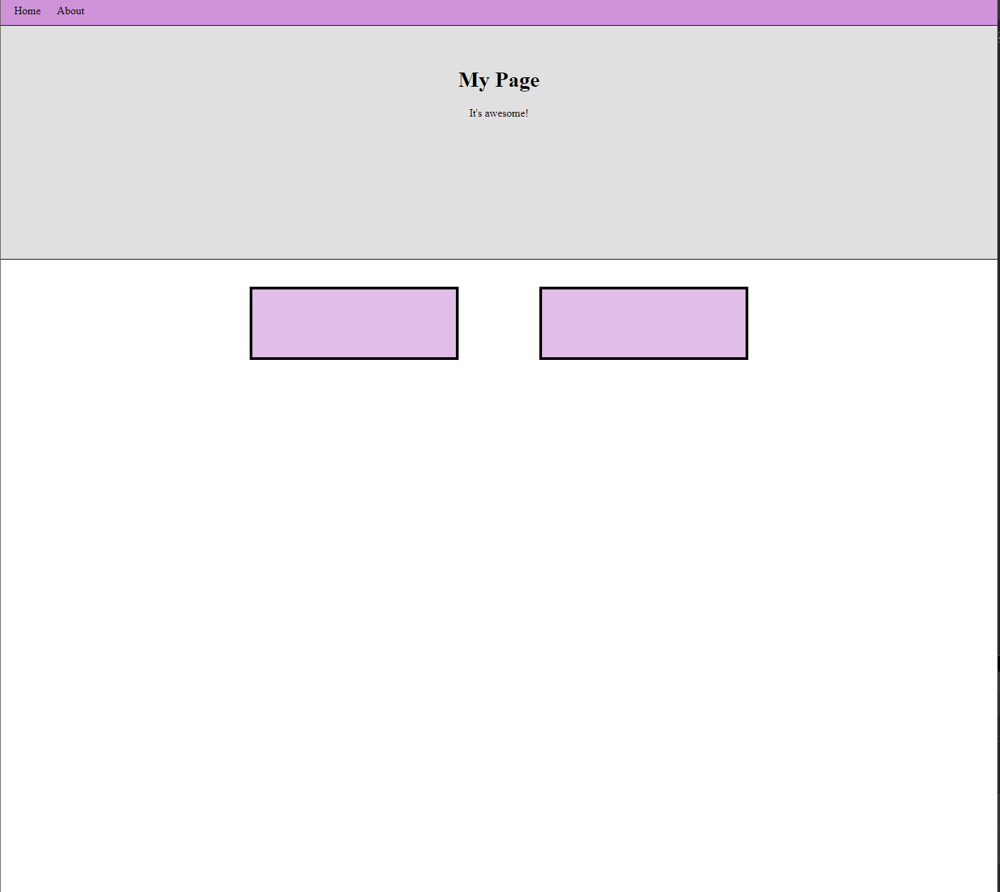

# Introduction To HTML


## Overview

We'll be going over the basics of HTML. In this lesson we'll review everything from creating to a HTML file, to building out a full html page.
This lesson covers HTML syntax and element types.


## Objectives

- Learn how to create an HTML file
- Learn about how an HTML file is structured
- Learn about different HTML tags
- Build a simple HTML page

## What You'll Be Building



## Getting Started

- Fork and Clone this repository

## What is HTML?

HTML stands for hyper text markup language. It has been in use since the advent of the internet. Every website you visit or interact with is built on or with HTML.

If we think of a building, HTML is the actual architecture of the structure. How many stories will the building have? How many walls and doors do we need? 
How much text and how many images will our site have? Once we have our building (webpage) structured out and created, we can begin working on its style (CSS) and then plugging it in and getting some functionality (Javascript)

Another analogy is the human body: Javascript is the Brain and nerves that control our actions. CSS is the skin and hair that define how we look. HTML would be our skeleton that everything is built up on. 


## Creating A HTML File

Inside of this lesson folder, create an `index.html` file. You can either do this in your terminal with `touch index.html` or with vscode's add file button located in your file explorer.

Open the `index.html` file you created. Once the file opens, type `!` and you should see a pop up to use `emmet abbreviations`. Hit the enter key to accept the suggestion. You should be given the following HTML:

```html
<!DOCTYPE html>
<html lang="en">
  <head>
    <meta charset="UTF-8" />
    <meta name="viewport" content="width=device-width, initial-scale=1.0" />
    <title>Document</title>
  </head>
  <body></body>
</html>
```

**If emmet did not work for you, feel free to copy and paste the above code into your `index.html`.**


This is known as "HTML Boilerplate" and it something you will see a variation of in every HTML file you find. Not all of it is necessary for each project you build - especially those "meta" tags, but as we build up more advanced sites which we can style, deploy to the web, and share, we will see what these do and what they are used for.


### Stop and Discuss 5 min

Talking points:

- Analyzing the current code
- Why is the file called `index.html`

## HTML Elements

HTML is built with elements or `tags`. For example, the `body` tag is an element. HTML supports many different tags, all of which serve different purposes and uses.


Realistically, there are probably around 50-100 different HTML elements that exist. There are new elements being developed every few seasons/years (iFrames, which allow us to embed Youtube and other video URLs into our page is just one example of a relatively modern one). There are some you will find that are outdated and have been replaced with more powerful elements. We will be doing a brief overview of some of these elements and their usage. The goal of this lesson is not to show you every single HTML tag, but rather to give you examples of some widely used ones, so that as you continuue on your journey, you will be able to figure out and use any that you encounter.  


As you can see, elements are wrapped in our angle bracers <> and are closed with a slash </>.
Some require content to be placed within and then closed
```
<h1> I am an H1 tag </h1>
<h2> I am a smaller H2 tag </h2>
```

While others, known as "Void Tags" are simply enclosed within themselves and do not need a second </> to close them off

This tag tells the computer we are using a standard ASCII letters and the characters we are familiar with (!, #, $, &, etc). If we wanted to use Mandarin, Cyrillic, Kanji, or characters from any other language inside of our code, we might have to use some different charset tags (don't worry about this for now!)

```
<meta charset="UTF-8"/>

```

And of course, everyone's favorite, adding Images into our page. 

```

```

The most important rule to understand is that while some elements may be contained within others (known as nesting), they must be closed off before starting a separate set of elements.


This is written correctly, and will work. Don't worry about the content yet, we'll discuss what these elements each do, but focus more on how we are structuring the elements.

```
<div>

    <a href="www.google.com">
      
        <h3> Click here to go to Google! </h3>
      
   </a>

</div>
```


Because our H3 is nested within the Anchor tag (a), it needs to be closed out before the Anchor is. Both of these have to be closed out before the Div is closed.


What is wrong with this block of code here?

```
<div>

  <a href="www.google.com">
  
      <h3> Click here to go to Google 
      
   </a>

      </h3>
      
 </div>      
 ```

Notice those little extra parts of the code, "href=" or "src="? Those are called "Data Attributes" and will be crucial once we begin connecting our HTML to CSS and JS. We'll discuss them a bit more later this lesson

```
<button class="shopping-button" id="add-cart">
      <h4> Add to Cart </h4>
</button>


<button class="shopping-button" id="return">
      <h4> Return to Store </h4>
</button>

<button class="shopping-button" id="checkout">
      <h4> Check Out </h4>
</button>

```

By now you've seen, a lot of HTML is written in a streamlined, semantic style. If you want to add a button, an audio file, or a section to your page, you will simply use the <button>, <audio> and <section> tags respectively. 

### Block Elements

Block elements, are `tags` that create a box. These elements stack `vertically` on the page in a column format.

Examples of basic block elements:

| Tag    | Uses                                                                       |
| ------ | -------------------------------------------------------------------------- |
| `div`  | A general use containing element                                           |
| `h<n>` | A header tag used to create different sized headings                       |
| `p`    | A paragraph tag to automatically size text to standard paragraph text size |

#### Semantic Tags

Semantic tags, are elements that have a special meaning. These tags aid screen readers in verbally giving feedback for users with disabilities.
Semantic tags were intoduced in the HTML 5 web standard.

Examples of semantic tags:

| Tag       | Uses                                                                                  |
| --------- | ------------------------------------------------------------------------------------- |
| `nav`     | An element that wraps elements for navigation purposes                                |
| `header`  | This element declares a primary heading section or call to action                     |
| `section` | Containing element to break areas of a page into individual sections                  |
| `article` | Containing element to declare articles on a web page                                  |
| `aside`   | A containing element that is typically used to keep elements to the side on webpages. |

### Inline Elements

These elements are used `inline` of block elements. This means that they stack horizontally and do not break up the flow of a page or element.
They are typically used to join groups of HTML elements on a single line.

Examples of inline elements:

| Tag     | Uses                                                                         |
| ------- | ---------------------------------------------------------------------------- |
| `a`     | Anchor tag used for creating links to external sites or different html pages |
| `span`  | `Spans` mutliple elements into a single line                                 |
| `br`    | Breaks text or elements to a new line on the page                            |
| `input` | An element that accepts a user input                                         |
| `img`   | Used for displaying images on a page                                         |

For a full list of HTML elements visit [W3 Schools](https://www.w3schools.com/html/html_blocks.asp)
  
You will not be asked to memorize every single one of these tags, and there will not be any exams testing how many of these you know. Like songs on the guitar, or recipes to cook, the goal is not to weigh down your brain memorizing all of these, but rather, understanding how to find resources to use whenever you need to use a less common tag. 
  
  
But thats enough of an intro for now. Lets start writing some code!  
  

### Adding Content To Our Page

Head over to your `index.html`. Let's start by adding a nav to our document. Inside of the `nav` tags, add in a `ul` tag followed by 2 `li` tags inside of the `ul`.
  
A "ul" is an Unordered List. An "ol" will created an numerically ordered list. Nested within these we add our "li" elements, which will be the individual items of the list.
  
The first `li` should contain the text `Home` and the second should contain the text `About`:

```html
<!DOCTYPE html>
<html lang="en">
  <head>
    <meta charset="UTF-8" />
    <meta name="viewport" content="width=device-width, initial-scale=1.0" />
    <title>Document</title>
  </head>
  <body>
        <nav>
          <ul>
            <li>Home</li>
            <li>About</li>
          </ul>
        </nav>
  </body>
</html>
```

Let's preview our changes. To open the `index.html` file:

- Mac Users: In your terminal use `open index.html`.
- WSL/Windows Users: Right click the `index.html` in your file explorer and select open in explorer. Once the explorer window opens, double click the `index.html`.

**NOTE**: Whenever you make a change to the `index.html`, you must refresh the browser page displaying the file.

Let's add in a `header` and a `section` tag next. The header should come after the closing `nav` tag and before the opening `section` tag.

```html
<!DOCTYPE html>
<html lang="en">
  <head>
    <meta charset="UTF-8" />
    <meta name="viewport" content="width=device-width, initial-scale=1.0" />
    <title>Document</title>
  </head>
  <body>
    <nav>
      <ul>
        <li>Home</li>
        <li>About</li>
      </ul>
    </nav>
    <header></header>
    <section></section>
  </body>
</html>
```

### You Do 10 min

Add some content to your page! Here are the necessary requirements, but feel free to add your own flair:

- Must have at least 1 `h1` tag.
- Must have at least 1 `p` tag.
- Must have at least 1 `section` tag.
- The `section` must have 2 `div` tags inside of it.
- Create an Ordered List, and add 2-3 different Li elements inside of it. Look how the computer will automatically serialize and style these lists for us!

Feel free to add images if you finish early!

## Element Attributes

All elements within a HTML document can have attributes or properties. These properties allow us to differentiate between elements or asign the same style to multiple elements. (More On This Later)

Here's a list of common html attributes:

| Attribute | Use Case                                                                    |
| --------- | --------------------------------------------------------------------------- |
| `id`      | Used to assign unique id to elements                                        |
| `class`   | Used to give elements the same `name` or `class` to style elements the same |
| `href`    | Used with anchor/`a` tags to define a link for navigation                   |
| `src`     | Used with `img` tags to define a source url for an image                    |

For a full list of HTML attributes visit [W3 Schools](https://www.w3schools.com/html/html_attributes.asp)

### Adding Attributes To Our HTML

In your `index.html`, give both of the `li` tags a class of `link`:

```html
<li class="link">Home</li>
<li class="link">About</li>
```

We'll use this class attribute later on to style these elements.

Now give your `section` an `id` attribute of `section-1`:

```html
<section id="section-1">
  <div></div>
  <div></div>
</section>
```

## Recap

In this lesson we learned how to set up a HTML file utilizing semantic tags and attributes.
There's more to HTML than meets the eye! Feel free to use this lesson to experiment with the html file and try different element combinations.

## Resources

- [W3 Schools](https://www.w3schools.com/html/default.asp)
- [35+ HTML/CSS Resources](https://medium.com/level-up-web/30-html-css-resources-for-beginners-4e4d0af4b44b)
